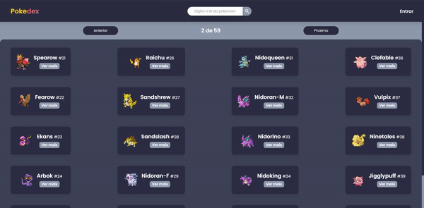
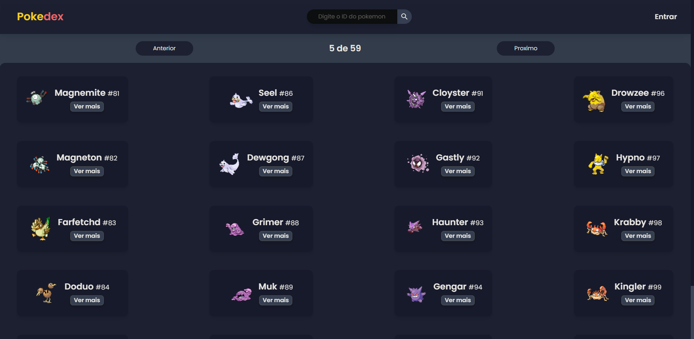
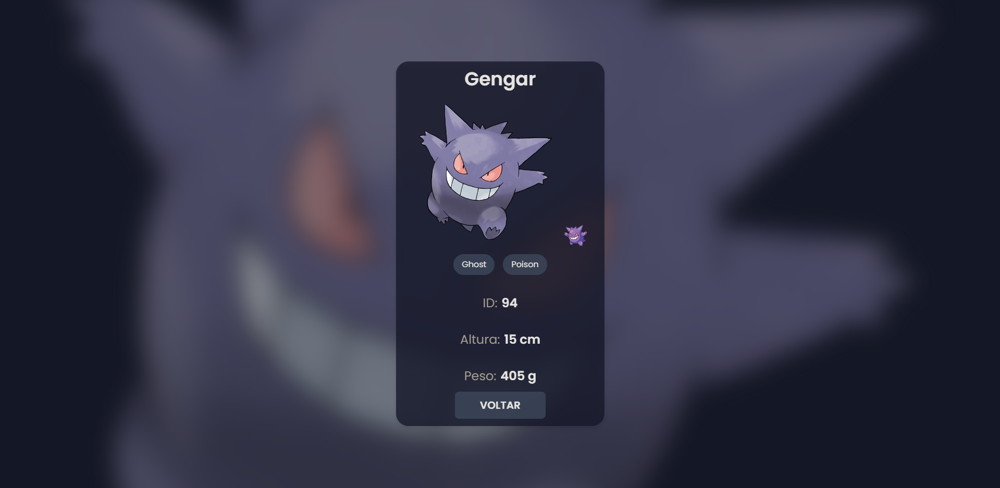

# Pokedex - Vite.js

Pokedex consumindo dados da PokéAPI feito com Vitejs, com funcionalidades de ver todos as peginas de pokemons e ver um por um utlizando urlParams.
 

# 📸 Fotos

 

# 💻 O Projeto

O projeto é uma Pokedex que consome dados da PokéAPI utilizando axios, para desenvolver a interface utilizei TailwindCSS

- TailwindCSS foi utilizado pra desenvolver a interface, trabalhando também com a responsividade;
- Pra parte de Data Fetching, utilizei o Axios juntamente com a PokéAPI;

# 🚀 Tecnologias

#### ✔️ ReactJS

#### ✔️ ViteJS

#### ✔️ TailwindCSS

#### ✔️ Axios
